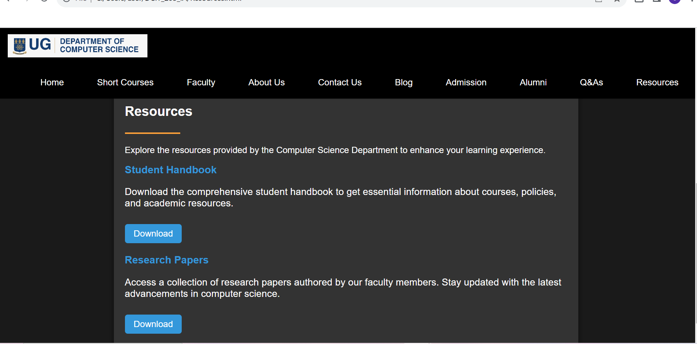
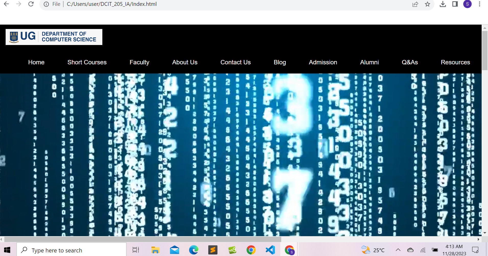
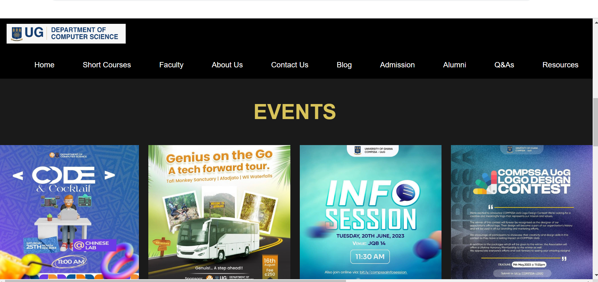
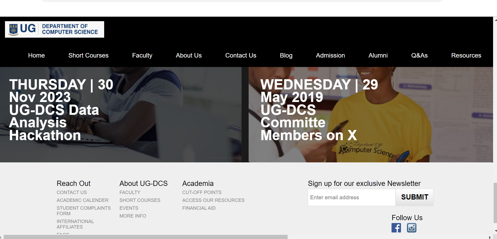
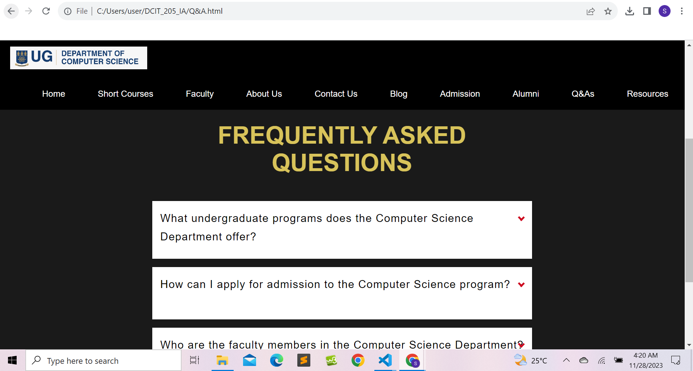

# DCIT_205_IA
# Computer Science Department website

# Introduction and Purpose of the website

## Introduction
Welcome to the department website for computer science! This project acts as our department's informational center online, offering details on courses, faculty, events, and more.

## Purpose
This platform serves as a comprehensive resource hub, connecting students, faculty, and enthusiasts to the dynamic world of computer science. Through this portal, we aim to provide a glimpse into the diverse realms of our department

## Project Setup
Follow these instructions to clone and set up the project locally:
### Prerequisites
- git bash
- Any IDE or Text Editor

## Detailed intructions to clone and set up the project
Set up Git: You will need to install Git on your computer if it isn't already installed. Visit (https://git-scm.com/) the official Git website, to obtain the version that corresponds to your operating system. Observe the given installation guidelines.

Select a Directory: Select the directory or folder on your PC that you wish to use for the project clone. This is where the project files are going to be kept. Go to that directory using a command prompt or terminal window open.

**Make a Repository Clone:** Use the following command to clone the project repository in the terminal or command prompt:
The command "git clone <repository-url>"

Change (<repository-url>) to the project's repository's real URL. This URL is usually supplied by the project owner or available on the project's hosting platform (GitHub, GitLab, etc.).

**Project Directory Navigation:** After the cloning process is finished, use the "cd" command to get to the project's directory.

Change {project-directory} to the true directory name for the project.

Launch the Project: You can begin working on the project once you have finished the steps mentioned above.

# Student Name and ID
Name : Daniel Nti Awuku
ID: 11137328

# Screenshots
!(Capture-1.PNG)              

# Project Reflection
What this project has taught me:

Technical Skills: Extensive knowledge of front-end web development, including HTML, CSS, and JavaScript.

Collaboration: Learned how to effectively communicate in a development team(even though this was a solo project i still got the concept of it all) by working on a collaborative project that used version control (Git).

Project Management: I acquired experience in adapting to unforeseen challenges, precise task planning and execution, resource managements, extensive research and managing my time effectively.

ID:11137328 
